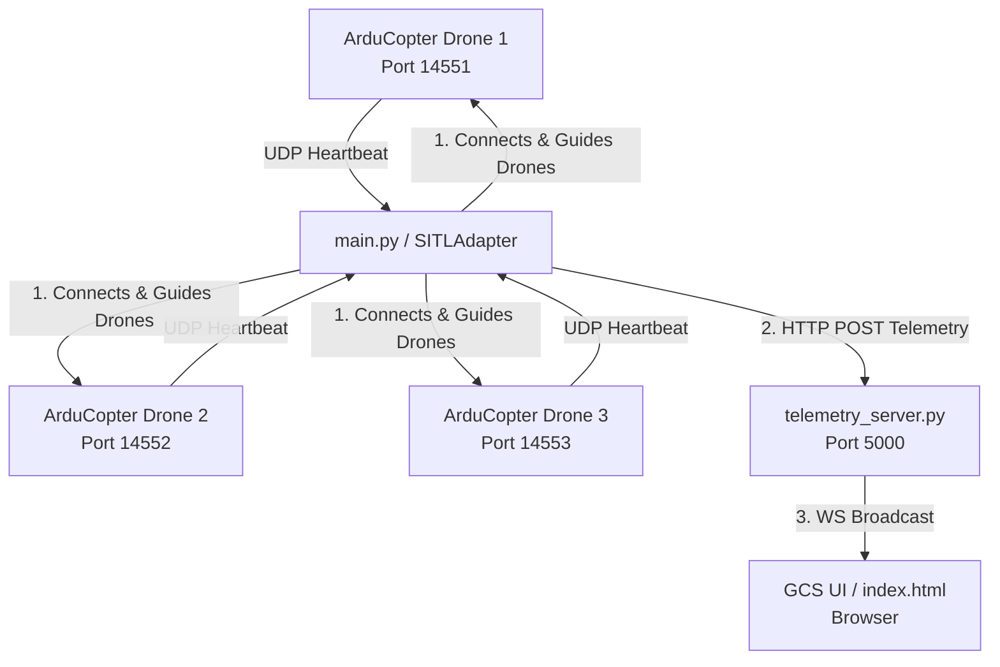

# Swarm Simulation & GCS Architecture Documentation

This document explains how the multi-drone swarm is launched, connected, and monitored, as well as how to scale the swarm to support more drones.

---

## 1. How to Add More Drones (Scaling the Swarm)

The system is configured to support up to **10 concurrent drones** in a V-shaped triangular formation. Follow these steps to scale the swarm:

1. **Launch the SITL Simulator with N drones:**
   When running the simulator script, pass the number of drones as an argument:
   ```bash
   cd /mnt/d/gcs_s2025/gcs_s2025/sitl_final_package
   ./start_sitl.sh <number_of_drones>
   ```
   *Example for 5 drones:*
   ```bash
   ./start_sitl.sh 5
   ```

2. **Start the Telemetry Server:**
   ```bash
   python3 mavlink_integration/telemetry_server.py
   ```

3. **Start the Mission Controller with N drones:**
   Pass the same number of drones via the `--drones` argument:
   ```bash
   python3 mavlink_integration/main.py --drones <number_of_drones>
   ```
   *Example for 5 drones:*
   ```bash
   python3 mavlink_integration/main.py --drones 5
   ```

---

## 2. Launch Architecture (How Drones are Launched)

When you execute `./start_sitl.sh <N>`:
* The script loops from `i = 0` to `N - 1`.
* It calculates the **System ID (SYSID)** and the **MAVLink Forwarding Port**:
  - `SYSID = i + 1` (Drone 1 is SYSID 1, Drone 2 is SYSID 2, etc.)
  - `PORT = 14551 + i` (Drone 1 uses 14551, Drone 2 uses 14552, etc.)
* **V-Shape (Triangular) Offsets**: It computes starting coordinate offsets in meters from a reference location (`33.6844, 73.0479`):
  - Drone 1 (Leader, Apex): `(0, 0)` meters.
  - Drone 2 (Left Wing): `(-15, -15)` meters.
  - Drone 3 (Right Wing): `(15, -15)` meters.
  - Drone 4 (Outer Left Wing): `(-30, -30)` meters.
  - Drone 5 (Outer Right Wing): `(30, -30)` meters.
  - *Followers continue branching backwards and outwards to maintain a perfect symmetrical V-shape.*
* **SITL Instance Spawning**:
  - A separate `instance_i` folder is created for each drone to store its specific settings and parameters.
  - The script uses `sim_vehicle.py` to start the ArduCopter SITL binary.
  - MAVLink traffic from each instance is forwarded via UDP to `127.0.0.1:$PORT`.

---

## 3. Connection and Telemetry Flow (How Drones Connect and Stream)



### Connection Phase
1. **Binding & Heartbeat**:
   - In `main.py`, a separate thread is spawned for each drone.
   - The thread initializes a `SITLAdapter` pointing to `udpin:0.0.0.0:$PORT`.
   - `pymavlink` listens on that UDP port and blocks on `wait_heartbeat()`.
   - Once the SITL simulation starts transmitting, `pymavlink` receives the heartbeat, establishing a secure connection.

### Mission & Telemetry Phase
2. **Commands**:
   - `main.py` commands the drones to enter `GUIDED` mode, arms them, initiates takeoff, and assigns waypoints.
   - The waypoints are dynamically computed with the V-shape triangular offsets, matching the spawn coordinates.

3. **Telemetry Streaming**:
   - `SITLAdapter` queries MAVLink messages (`GLOBAL_POSITION_INT`, `SYS_STATUS`, `ATTITUDE`, `HEARTBEAT`) at 1 Hz.
   - The adapter sends this telemetry data via HTTP POST to `http://127.0.0.1:5000/send_telemetry`.
   - The Quart telemetry server (`telemetry_server.py`) receives the POST and pushes the data onto an asynchronous WebSocket queue.
   - The telemetry server broadcasts the queue data to all connected clients at `/ws`.
   - The frontend (`index.html`) listens to the WebSocket connection. When data arrives, it:
     - Automatically registers and creates a tab/marker if the drone is new.
     - Colors `drone_1` (Leader) in **Bright Gold (`#ffd700`)** and all other drones (Followers) in **Cyan (`#00e5ff`)**.
     - Updates the drone's position on the map, updates its flight path, rotates its icon based on heading (yaw), and shows its telemetry on the dashboard.

---

## 4. Drone Registry

The system uses a drone registry that maps each drone to a unique system ID and UDP port:

| Drone ID  | System ID | UDP Port | Connection String         | Role                |
|-----------|-----------|----------|---------------------------|---------------------|
| `drone_1` | 1         | 14551    | `udpin:0.0.0.0:14551`     | Leader (V Apex)     |
| `drone_2` | 2         | 14552    | `udpin:0.0.0.0:14552`     | Left Wing Row 2     |
| `drone_3` | 3         | 14553    | `udpin:0.0.0.0:14553`     | Right Wing Row 2    |
| `drone_4` | 4         | 14554    | `udpin:0.0.0.0:14554`     | Left Wing Row 3     |
| `drone_5` | 5         | 14555    | `udpin:0.0.0.0:14555`     | Right Wing Row 3    |

Each drone is managed by its own `SITLAdapter` object created in `main.py`. Telemetry is logged independently per drone, and all packets include a `drone_id` field to prevent confusion between drones.

---

## 5. Telemetry Packet Format

Every telemetry message sent from the backend to the GCS frontend follows this JSON format:

```json
{
  "drone_id": "drone_1",
  "battery": {
    "voltage": 12.60,
    "remaining": 87,
    "current": 15.15
  },
  "mode": "GUIDED",
  "armed": true,
  "position": {
    "lat": 33.665137,
    "lon": 73.027023,
    "alt": 10.0,
    "heading": 45.0,
    "timestamp": "2026-06-26T10:00:00.000000"
  },
  "attitude": {
    "roll": 0.5,
    "pitch": -1.2,
    "yaw": 45.0
  },
  "rc_signal": 98
}
```

### Fields Collected Per Drone
- **Position**: Latitude, longitude, relative altitude (clamped ≥ 0)
- **Mode**: Current flight mode (e.g., GUIDED, LAND, STABILIZE)
- **Battery**: Voltage (V), remaining (%), current draw (A)
- **Armed Status**: `true` or `false`
- **Attitude**: Roll, pitch, yaw in degrees
- **RC Signal**: Signal strength percentage

---

## 6. Telemetry Logging

### Per-Drone Logs
Each drone's telemetry is automatically saved as JSON-lines to:
```
logs/drone_1_telemetry.log
logs/drone_2_telemetry.log
logs/drone_3_telemetry.log
...
```

### Combined Swarm Log
All per-drone logs can be merged into a single file via the HTTP endpoint:
```
GET http://localhost:5000/export_swarm_log
```
This creates and returns `logs/swarm_telemetry_combined.log`.

### Flight Path Exports
After each mission completes, each drone exports its flight path in two formats:
- **CSV**: `logs/drone_1_flight_path.csv`
- **GeoJSON**: `logs/drone_1_flight_path.geojson`

---

## 7. How to Run the GCS in WSL (Complete Step-by-Step Guide)

### 7.1 Prerequisites

1. **Windows Subsystem for Linux (WSL)** must be installed and running Ubuntu.
   ```powershell
   # Run this in PowerShell as Administrator (if WSL is not installed)
   wsl --install
   ```

2. **ArduPilot SITL** must be installed in WSL. Follow the official guide:
   https://ardupilot.org/dev/docs/building-setup-linux.html

3. **Python 3** with `pip` must be available inside WSL.

### 7.2 One-Time Setup (Install Python Dependencies)

Open a WSL terminal and run:
```bash
cd /mnt/d/gcs_s2025/gcs_s2025/sitl_final_package
python3 -m venv final_venv
source final_venv/bin/activate
pip install -r requirements.txt
```

### 7.3 Running the Swarm (Step-by-Step)

You will need **3 separate WSL terminal tabs/windows**. All commands are run from inside WSL.

#### Step 0: Kill Any Old Processes (Optional but Recommended)
```bash
killall -9 arducopter mavproxy.py xterm python3 2>/dev/null
```

#### Step 1: Start the SITL Drone Instances (Terminal 1)
```bash
cd /mnt/d/gcs_s2025/gcs_s2025/sitl_final_package
bash start_sitl.sh 3
```
This launches 3 ArduCopter SITL instances. You will see output like:
```
🚀 Launching Drone 1 (Instance 0) at Lat=33.6844, Lon=73.0479 → port 14551
🚀 Launching Drone 2 (Instance 1) at Lat=..., Lon=... → port 14552
🚀 Launching Drone 3 (Instance 2) at Lat=..., Lon=... → port 14553
```

> ⏳ **IMPORTANT**: Wait **3–4 minutes** for all drones to achieve GPS lock before proceeding.
> Monitor progress with:
> ```bash
> tail -f /tmp/sitl_instance_0.log
> ```
> Look for `EKF3 IMU0 is using GPS` — that means the drone is ready.

#### Step 2: Start the Telemetry Server (Terminal 2)
```bash
cd /mnt/d/gcs_s2025/gcs_s2025/sitl_final_package/mavlink_integration
source ../final_venv/bin/activate
python3 telemetry_server.py
```
The server will start on `http://0.0.0.0:5000`.

#### Step 3: Open the GCS Dashboard (Browser)
Open your **Windows web browser** (Chrome/Edge/Firefox) and navigate to:
```
http://localhost:5000
```
You should see the GCS Live Flight Control dashboard with the map and sidebar.

#### Step 4: Run the Mission Controller (Terminal 3)
```bash
cd /mnt/d/gcs_s2025/gcs_s2025/sitl_final_package/mavlink_integration
source ../final_venv/bin/activate
python3 main.py --drones 3
```
Make sure the `--drones` count matches the number passed to `start_sitl.sh`.

The controller will:
1. Wait for heartbeats from each drone
2. Wait for GPS + EKF alignment
3. Set GUIDED mode → Arm → Takeoff
4. Navigate waypoints in V-formation
5. Land and disarm

The GCS dashboard will show all drones moving in real-time on the map.

### 7.4 Scaling to More Drones (Up to 10)

To run with 5 drones instead of 3:
```bash
# Terminal 1:
bash start_sitl.sh 5

# Terminal 2:
python3 telemetry_server.py

# Terminal 3:
python3 main.py --drones 5
```

---

## 8. Troubleshooting

### "Waiting for heartbeat..." hangs forever
- **Cause**: SITL instances are not running, or not yet ready.
- **Fix**: Make sure `start_sitl.sh` has been run first and wait 3–4 minutes for GPS lock. Check logs with `tail -f /tmp/sitl_instance_0.log`.

### "Waypoint file not found: waypoints.json"
- **Cause**: Running `main.py` from the wrong directory (older versions used a relative path).
- **Fix**: This has been fixed. `main.py` now resolves `waypoints.json` relative to its own directory automatically.

### "ModuleNotFoundError: No module named 'quart'"
- **Cause**: Python dependencies not installed.
- **Fix**: Activate the virtual environment and install requirements:
  ```bash
  source final_venv/bin/activate
  pip install -r requirements.txt
  ```

### WebSocket connects but no telemetry appears on the dashboard
- **Cause**: The telemetry server's broadcast worker may not be running.
- **Fix**: This has been fixed. The `@app.before_serving` startup hook now correctly starts the broadcast worker.

### "bash: venv/bin/activate: No such file or directory"
- **Cause**: The virtual environment is named `final_venv`, not `venv`.
- **Fix**: Use `source final_venv/bin/activate` instead.

### Drones fail to arm ("Arming command rejected")
- **Cause**: GPS/EKF not yet aligned. The system automatically retries until alignment is achieved.
- **Fix**: Wait longer. If it persists for more than 5 minutes, restart the SITL instances.
